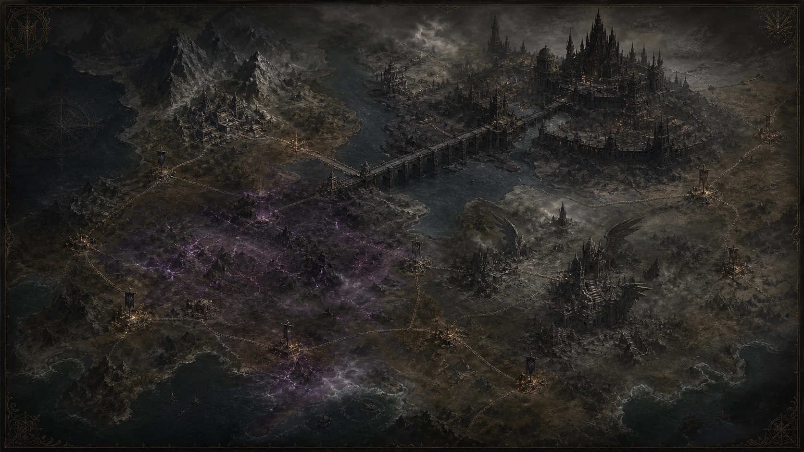

# 라온제나: 지워진 구원의 기록

《라온제나》 월드 바이블을 **라온의 시점으로 끊김 없이 이어지는 내러티브 전술 RPG**로 번역한 웹 게임입니다. 단일 전투 데모에서 출발했지만, 현재는 장면·내면·대화·선택·전투·회고가 하나의 저장 데이터로 이어지는 장편 RPG 기반을 갖춥니다.



## 라온 시점 플레이 구조

```text
장면 내레이션
→ 라온의 내면 독백
→ 동료와의 대화
→ 연민·통찰·결의 중 행동 선택
→ 선택이 반영된 전투
→ 승리·패배 후 라온의 회고
```

- **연민:** 보호 목표에 시작 방벽을 제공합니다.
- **통찰:** 확인된 적의 노출을 쌓아 첫 연계를 쉽게 엽니다.
- **결의:** 시작 사기를 높여 초반 선택지를 늘립니다.
- **전투:** 적의 다음 행동을 읽고, 서로 다른 조장 3명을 같은 적에게 연결해 `BREAK`를 만드는 3명령 전술 퍼즐입니다.

라온은 항상 출전하며, 플레이어는 제국 전체를 관리하는 익명의 지휘관이 아니라 **라온이 무엇을 보고 어떤 사람이 될지 결정하는 주체**가 됩니다.

## 현재 플레이 가능한 범위

- 제7기 6인 전술 편성: 하도리, 라온, 카즈린, 카인, 레오, 크리스
- 8개 연속 작전 브리핑과 **8개 완전 플레이 가능 전투**
  - `회색 교각 호송`
  - `시티즌의 탄피`
  - `비어 있는 기수의 마을`
  - `날개 없는 호송`
- `하늘의 총성` · 공중 포대가 매 라운드 목표를 포격하는 강습전
- `바이올렛의 밤` · 짝수 라운드마다 잠입조가 다시 숨는 기록 봉쇄전
- `저주받은 경계` · 광역 공격이 중립 목표까지 해치는 삼파전
- `멈춘 꽃잎` · 전원이 지속 피해를 받는 시간 기억 대면전
- 임무별 적 편성·목표물·라운드 제한·교리·보상·진실 폭로
- 지휘점, 사기, 방벽, 은폐, 노출, 기절, 광역기, 제7기 합동기
- 전투 등급 `S/A/B/C`, 경험치, 레벨, 기술점, 유대, 장비 슬롯
- 4~6인 출격 편성, 출격조 전용 경험치, 14종 회수 장비와 실제 능력치 반영
- 제국·민간 공동체·저주받은 땅·체시 생존권의 4세력 평판
- 6개 비전투 파견과 선행 작전·보급 비용·장비 보상
- 프시케 본부의 5개 시설과 보급품 기반 업그레이드
- 하루 3회의 지휘 행동을 사용하는 **일일 지휘 루프**
- 개인 훈련·유대 훈련·현장 활동을 고르게 수행하면 추가 보상을 받는 **균형 지휘 목표**
- 훈련·첫 생환·현장 활동·관계·제작을 장기적으로 안내하는 **6개 전역 명령**
- 모든 운영 화면에서 날짜·행동력·자원·다음 권장 목표를 보여주는 **지휘 덱 HUD**
- 3종 개인 훈련, 15개 조장 페어 유대 훈련, 6개 반복 현장 활동
- 구세계 공방에서 자원과 시설 레벨을 사용하는 5개 유산 장비 제작
- 월드맵 작전 해금, 선행 임무, 지역 정보, 위협도
- 전투 행동 취소·미행동 조장 자동 선택·임무 준비도·전투 기록 피드백
- 서사 중심 `기록`, 기본 경험 `정규`, 보상 강화 `생환`의 **3단계 임무 난이도**
- 모바일 전장에서 필요할 때만 펼치는 하단 전술 명령 패널과 안전한 2단계 작전 포기
- 키보드 포커스, 현재 메뉴 안내, 축소 모션 대응을 포함한 접근성 보강
- 로컬 세이브, 첫 클리어 보상, 최고 등급 갱신형 재도전, 진행도 초기화
- 공식 기록과 실제 역사가 갈라지는 연대기·인물 도감·검색 가능한 아트 아카이브
- 사용자가 제공한 20장 설정화 전수와 신규 작전 미술을 합친 28개 아카이브 자산

## 장기 RPG 목표 규모

게임 전체는 원전의 공개 순서를 따라 **72개 주 작전과 144개 선택 작전**을 담는 네 권의 캠페인으로 설계합니다.

1. `꽃잎이 피기 전` — 프시케 제7기 전반, 8개 주 작전
2. `해찬전` — 여섯 군단이 가족이 되고 갈라지는 대전쟁 군상극, 24개 주 작전
3. `두 번째 대전쟁` — 제7기 후반과 선대의 귀환, 24개 주 작전
4. `구원 이전` — 모든 결말 이후 공개되는 라미전, 16개 주 작전

세부 제작 단계와 확장 시스템은 [대형 RPG 확장 로드맵](docs/EXPANSION_ROADMAP.md)에 정리했습니다.

## 실행

웹 서사·전투 설계실은 아래 명령으로 실행합니다. Unity 3D 본편의 첫 조작 기반은 [PsycheAdventure 시작 안내](unity/PsycheAdventure/README.md)에 있습니다. Unity 기반은 현재 소스 구현 단계이며 Editor 컴파일·플레이 검증은 대기 중입니다.

```bash
pnpm install
pnpm dev
```

Vite가 비어 있는 로컬 포트를 자동 선택합니다.

## 검증

```bash
pnpm test
pnpm lint
pnpm build
```

## 프로젝트 구조

```text
src/
  components/        작전실·월드맵·본부·일일 지휘·조장단·도감 UI
  data/              정사 데이터, 임무, 시설, 전투 유닛
  game/              전투 엔진, 성장·저장 엔진, 단위 테스트
docs/
  screenshots/       데스크톱·모바일 실기 검증 화면
  source/            114쪽 월드 바이블과 전수 추출본
public/
  art/archive/       제공 원화의 웹 최적화본
  art/generated/     누락 영역을 위해 제작·검증한 신규 원화
  content/           원전 구조화 JSON
```

## 문서

- [다른 로컬에서 이어받기](docs/HANDOFF_CURRENT.md)
- [젤다·붉은사막 수준을 위한 제작 조사](docs/AAA_PRODUCTION_RESEARCH.md)
- [Unity 3인칭 조작 기반과 검증 상태](docs/THIRD_PERSON_FOUNDATION.md)
- [게임 설계](docs/GAME_DESIGN.md)
- [대형 RPG 확장 로드맵](docs/EXPANSION_ROADMAP.md)
- [정사 판정](docs/CANON_STATUS.md)
- [아트 디렉션과 자산 검증](docs/ART_DIRECTION.md)
- [원전 Markdown](docs/source/world-bible-v3.1.md)

이 저장소의 목표는 원전을 축약하는 것이 아니라, **원전을 보존한 채 독자가 진실을 발견하는 순서를 장기 플레이 경험으로 번역하는 것**입니다.

## 작업 보고서와 자산 보존 확인

- [2026년 9월 작업 보고서·검증 증빙](docs/reports/2026-09-handoff/README.md)
- [GitHub 자산 보존 및 로컬 정리 점검](docs/reports/2026-09-17-backup-audit.md)

GitHub 저장소 이름은 게임명에 맞춰 `junlee122-bot/raonjena`로 변경했다. 새 PC의 시작 절차는 [현재 인계 안내](docs/HANDOFF_CURRENT.md)를 따른다.
